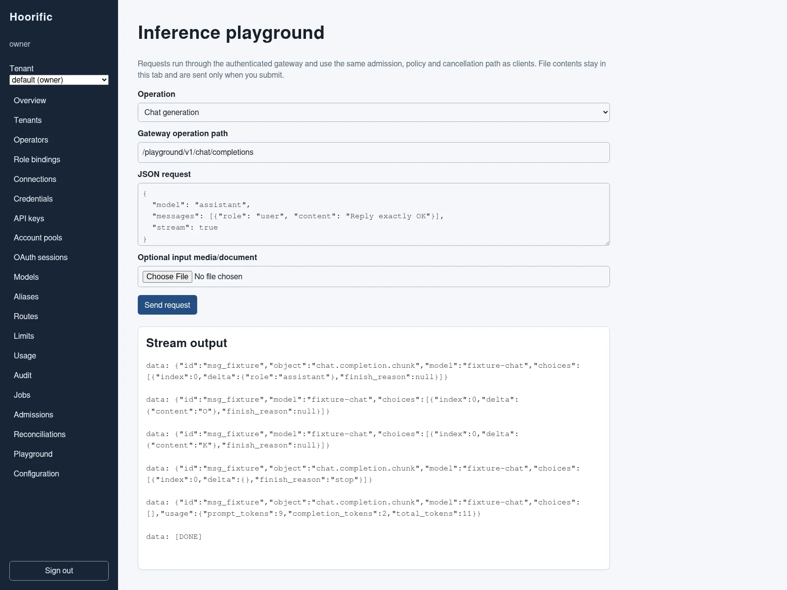
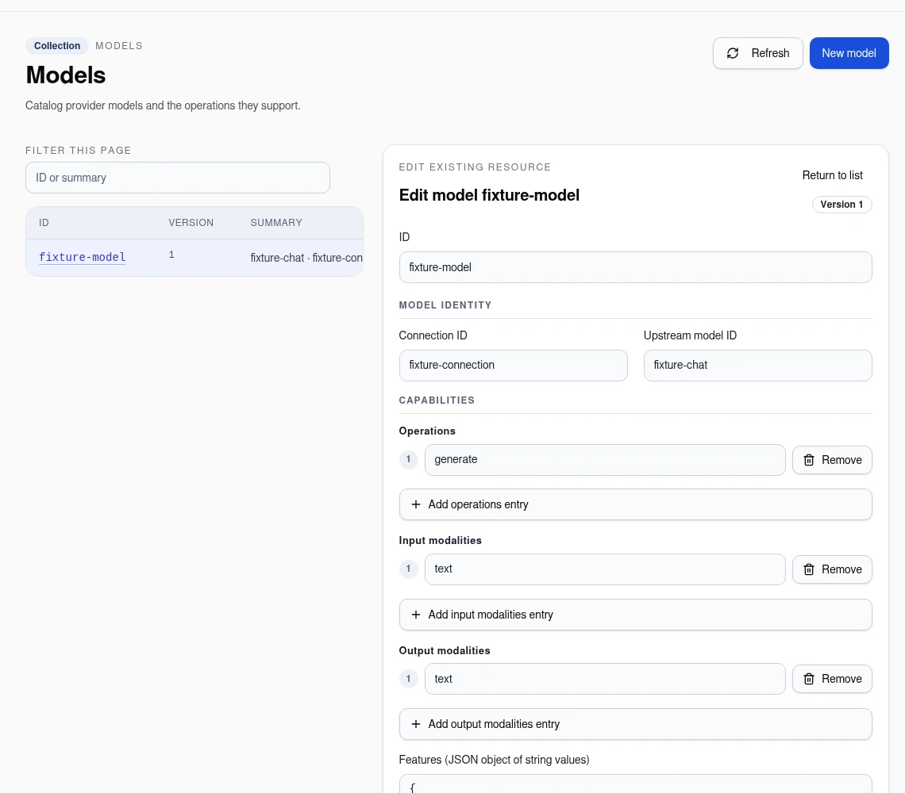
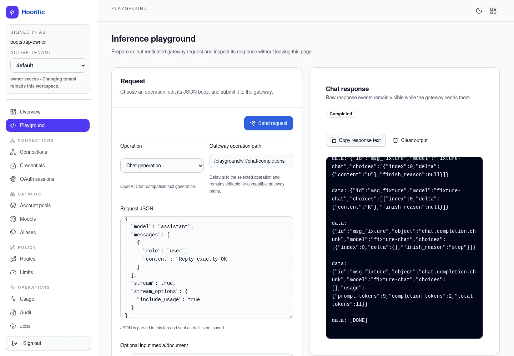
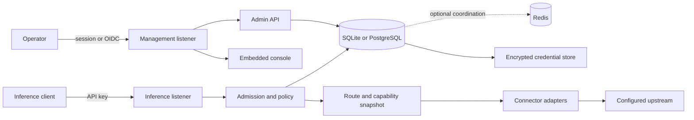

<div align="center">

# Hoorific

**A self-hosted, policy-aware gateway for model traffic**

Route compatible inference requests through explicit connections, credentials, policies, and accounting while keeping the operator surface in one embedded console.

[](https://github.com/openhoo/hoorific/actions/workflows/ci.yml) [](LICENSE)

[Console guide](docs/console.md) · [Documentation](docs/deployment.md) · [Qualification](docs/qualification.md) · [Performance](docs/performance.md) · [Contributing](CONTRIBUTING.md) · [Security](SECURITY.md)

</div>



*Real console, synthetic local fixture data. The screenshot is not a live-provider or account-entitlement claim.*

Hoorific is a Go gateway for teams that need a small, inspectable control plane in front of model providers and compatible endpoints. The inference listener and management listener are separate; the management API and same-origin React console configure the resources that the gateway is allowed to use.

> **Publication status**  Hoorific is published as source. This repository does not currently publish a container image or a release artifact. Build the image locally, or publish it to a registry you control before using the Helm chart.

## What it provides

- **Explicit routing and admission.** Tenants, connections, models, aliases, route policies, limits, API keys, admissions, usage, and audit records are durable resources rather than implicit process flags.
- **Encrypted credential lifecycle.** Credential listings expose metadata only. Import, rotation, revocation, OAuth, and device flows are bound to a connection and use the encrypted store; generic credential CRUD is intentionally not an administrative contract.
- **Portable and native protocols.** Built-in codecs cover OpenAI chat, responses, and completions; Anthropic messages; Gemini content; Bedrock Converse; Cohere v2; Ollama; embeddings; and reranking where a registered operation supports them. Streaming is available only for operations whose exact codec advertises a stream.
- **Provider adapters.** The built-in connector catalog includes OpenAI, Anthropic, Gemini, Cohere, Ollama, Hugging Face, Replicate, fal, Azure OpenAI, Vertex, Bedrock, and explicitly configured compatible endpoints. Optional subscription connectors are disabled unless enabled in configuration.
- **Cost-safe accounting.** Provider prompt caching is distinct from opt-in response replay; cache controls are never turned into automatic explicit writes, and missing usage or rates remain unknown rather than guessed.
- **Standalone or cluster storage.** Standalone mode uses SQLite. Cluster mode uses PostgreSQL and can use Redis for coordination. The two storage modes are mutually exclusive in configuration.
- **A focused operator surface.** `/admin/` serves the embedded React console, built with shadcn/ui components and Tailwind CSS. Workflow-oriented navigation leads from connections and models to routing and operations. Resource pages open on the collection, with explicit create/edit workspaces, page-local filtering, and draft-discard confirmation when selecting another resource, starting a new one, or returning to the list. The playground shows request and response side by side on wide screens, with copy, clear, and cancellation controls. Forms adapt to their available width; light/dark themes and keyboard navigation work on desktop and mobile. `/admin/api/v1/` serves the authenticated management API; health and metrics remain on the management listener.
- **A small runtime boundary.** The Dockerfile produces a `scratch` image that runs as UID/GID `10001` and supports a read-only root filesystem, with CA certificates, timezone data, `/tmp`, and the mounted data directory. There is deliberately no shell in the runtime image.

These are implementation boundaries, not provider entitlement claims. A configured connector still needs valid operator-supplied credentials, reachable upstreams, and a model or operation supported by that connection's capability inventory.

## Console visual tour

The embedded [console guide](docs/console.md) turns the post-bootstrap flow into an operator checklist. These views come from the isolated deterministic fixture described there; they illustrate the UI, not provider access or account entitlement.

<table>
  <tr>
    <td align="center">
      <a href="docs/console.md#models-aliases-routes-and-limits">
        
      </a><br>
      <strong><a href="docs/console.md#models-aliases-routes-and-limits">Models editor</a></strong> — inspect the selected <code>fixture-model</code> before routing it.
    </td>
    <td align="center">
      <a href="docs/console.md#playground">
        
      </a><br>
      <strong><a href="docs/console.md#playground">Playground</a></strong> — send a deterministic fixture request and inspect its response.
    </td>
  </tr>
</table>

Use the [models and routing workflow](docs/console.md#models-aliases-routes-and-limits) to prepare an approved route, then follow the [playground walkthrough](docs/console.md#playground) to exercise it.

## Architecture



The chart is a cluster-mode deployment shape around this same process. It expects externally managed PostgreSQL, encryption, and optional Redis/OIDC secrets; its default data volume is ephemeral. See [Deployment](docs/deployment.md) before adapting it to a persistent production environment.

## Quickstart (native loopback)

For a complete local operator flow, run the built binary directly on the host.
This keeps the management peer at `127.0.0.1`, which is required by the
one-time local bootstrap endpoint. Complete the
[source-build sequence](#build-from-source) first.

The commands refuse to reuse an existing local state directory. The keyring
and configuration are created with restrictive permissions and exclusive file
creation; rerunning the setup cannot silently replace a key used by an
existing database.

```sh
set -eu
umask 077

state=.local/hoorific
if [ -e "$state" ] || [ -L "$state" ]; then
  printf 'Refusing existing state directory: %s\n' "$state" >&2
  exit 1
fi
mkdir -p "$state/data"

python3 - "$state/master.key" "$state/config.json" "$state/data" <<'PY'
import base64
import json
import os
import pathlib
import sys

key_path = pathlib.Path(sys.argv[1]).resolve()
config_path = pathlib.Path(sys.argv[2]).resolve()
data_dir = pathlib.Path(sys.argv[3]).resolve()
key_id = os.urandom(16).hex()
key = base64.b64encode(os.urandom(32)).decode("ascii")

key_fd = os.open(
    key_path, os.O_WRONLY | os.O_CREAT | os.O_EXCL, 0o400
)
with os.fdopen(key_fd, "w") as stream:
    json.dump({"current": key_id, "keys": {key_id: key}}, stream)
    stream.write("\n")

config = {
    "schema_version": 1,
    "mode": "standalone",
    "data_dir": str(data_dir),
    "listeners": {
        "inference": "127.0.0.1:8080",
        "management": "127.0.0.1:8081",
    },
    "storage": {
        "sqlite": {"path": str(data_dir / "hoorific.sqlite")},
        "postgres": {"dsn_file": ""},
    },
    "coordination": {"redis": {"url_file": ""}},
    "encryption": {"key_file": str(key_path)},
    "oidc": {"issuer": "", "client_id": "", "client_secret_file": ""},
    "public_urls": {},
    "subscription_connectors": {"enabled": False},
}
config_fd = os.open(
    config_path, os.O_WRONLY | os.O_CREAT | os.O_EXCL, 0o400
)
with os.fdopen(config_fd, "w") as stream:
    json.dump(config, stream, indent=2)
    stream.write("\n")
PY

./.artifacts/hoorific migrate --config "$state/config.json"
bootstrap_code="$(
  ./.artifacts/hoorific admin bootstrap --config "$state/config.json"
)"
printf 'Enter this one-time code at http://127.0.0.1:8081/admin/: %s\n' \
  "$bootstrap_code"
./.artifacts/hoorific serve --config "$state/config.json"
```

While `serve` is running, open <http://127.0.0.1:8081/admin/> and enter the
printed code in the local bootstrap form. In another terminal,
`curl --fail http://127.0.0.1:8081/health/ready` checks readiness. Keep the
keyring and `.local/hoorific/data` directory together; encrypted records cannot
be recovered from a database without the retained key versions.

To configure a first route in the console:

1. Add a connection with the intended connector, account, and upstream endpoint.
2. Import credentials through that connection's actions, not generic credential CRUD.
3. Review discovered models and explicitly approve the model operations and capabilities.
4. Connect a model alias to a route policy and set the admission limits you need.
5. Issue an API key scoped to that alias, connection, and operation. Store its one-time value securely.

## Container image and Compose

Build a local image with Docker or Podman:

```sh
podman build --tag hoorific:local .
# or: docker build --tag hoorific:local .
```

The checked-in [Compose file](compose.yaml) runs the same binary as UID/GID
`10001` with a read-only root filesystem, a named data volume, and explicit
read-only config/master-key mounts. Use a container-specific configuration with
`listeners.management` set to `:8081` and paths `/var/lib/hoorific` and
`/run/secrets/hoorific-master-key`; the native config above binds management to
`127.0.0.1:8081` and uses host paths, so it must not be mounted unchanged.
Follow [Deployment](docs/deployment.md#standalone-compose) for secure key/file
ownership and Compose startup.

After creating those container paths with the secure procedure in
[Deployment](docs/deployment.md#master-key-handling), start the local stack:

```sh
export HOORIFIC_CONFIG="$PWD/.local/hoorific-container/config.json"
export HOORIFIC_MASTER_KEY="$PWD/.local/hoorific-container/master.key"
export HOORIFIC_IMAGE=hoorific:local
podman compose up -d
curl --fail http://127.0.0.1:8081/health/ready
```

The container's ordinary published port is not a loopback peer inside the
container network namespace. Consequently, host-browser or host-`curl`
bootstrap requests through a bridge port fail the deliberate loopback check.
Use the native quickstart for a local bootstrap flow, or configure OIDC and an
intentional network/TLS design for a container deployment; do not weaken the
bootstrap guard.

No container image is published by this repository. Build locally or provide
an image from a registry you control before using the Helm chart.

## Build from source

A fresh checkout must build the API schema before generating the web client, then build the console before compiling the Go binary. Generated API types and compiled console assets are build outputs and are not source inputs to commit.

Prerequisites:

- Go **1.27** (the version declared by [go.mod](go.mod)).
- Bun **1.3.14** (the version pinned by the [Dockerfile](Dockerfile)); `bun.lock` is authoritative for web dependencies.
- An OCI-compatible builder such as Docker BuildKit or a modern Podman/Buildah for the container path.

```sh
set -eu
mkdir -p .artifacts web/src/generated

go run ./tools/schema --output .artifacts/admin-openapi.json
(cd web && bun install --frozen-lockfile)
bun run --cwd web generate-api
bun run --cwd web build
CGO_ENABLED=0 go build -trimpath -ldflags='-s -w' -o .artifacts/hoorific ./cmd/hoorific
```

The equivalent reproducible container build is:

```sh
podman build --tag hoorific:local .
# or: docker build --tag hoorific:local .
```

The Dockerfile's schema stage imports only the schema, admin, and core packages. It creates `web/src/generated` inside the build, installs the locked Bun dependencies, generates the API types, builds the console, and embeds the resulting assets into the Go binary. Do not copy `.artifacts`, local databases, credentials, or host-built console output into a public checkout.

## Verification

Run ordinary Go tests after the source-build sequence:

```sh
go test ./...
```

For an end-to-end deterministic qualification against an owned loopback fixture:

```sh
go run ./tools/verify \
  --binary .artifacts/hoorific \
  --mode standalone \
  --scenario all \
  --output .artifacts/verify-standalone.json
```

To inspect only the cost-safety contracts against temporary provider
fixtures, use the focused selector:

```sh
go run ./tools/verify \
  --binary .artifacts/hoorific \
  --mode standalone \
  --scenario cost-safety \
  --output .artifacts/verify-cost-safety.json
```

This selector does not contact a paid provider; it is not evidence of
provider entitlement, pricing, or cache savings.

The verifier owns temporary state, credentials, listeners, and fixture data. It does not prove a provider account, paid entitlement, or a production deployment. Browser, cluster, live-provider, and credential crash-boundary procedures are documented in [Qualification](docs/qualification.md). Keep generated reports private; `.artifacts/` is local operator evidence, not a repository asset.

For a repeatable traffic measurement against a provisioned gateway and deterministic loopback upstream, see [Performance](docs/performance.md). Historical timing tables there are machine-specific reference observations, not service-level guarantees.

## Deployment boundaries

- **Provider access is explicit.** Subscription connectors and default cloud credential chains require opt-in. The verifier does not discover ambient host or CLI credentials. Live qualification requires operator-supplied authenticated files and enforces a spend ceiling before dispatch.
- **Kubernetes is a template, not a claim of deployment.** The Helm chart requires existing secrets and an image you build or publish. The default chart uses external PostgreSQL and ephemeral `emptyDir` data; choose persistence and network policy deliberately.
- **No image or release is implied.** Until a release workflow and registry are intentionally configured, use locally built images or your own registry coordinates.
- **Management exposure is deliberate.** Keep the management listener on a private network or loopback unless you have configured TLS, trusted origins, authentication, and network controls for your environment.

## Documentation and project links

- [Deployment and configuration](docs/deployment.md)
- [Embedded console guide and visual workflows](docs/console.md)
- [Qualification and benchmark operations](docs/qualification.md)
- [Performance benchmark and image-footprint methodology](docs/performance.md)
- [Helm chart](charts/hoorific/)
- [Contributing](CONTRIBUTING.md)
- [Security policy](SECURITY.md)
- [Issue tracker](https://github.com/openhoo/hoorific/issues)

## License

Licensed under the [Apache License, Version 2.0](LICENSE).
