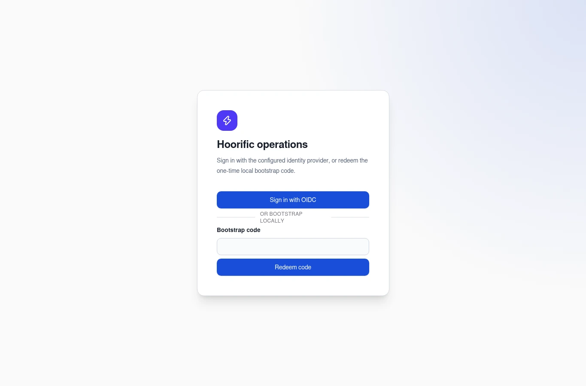
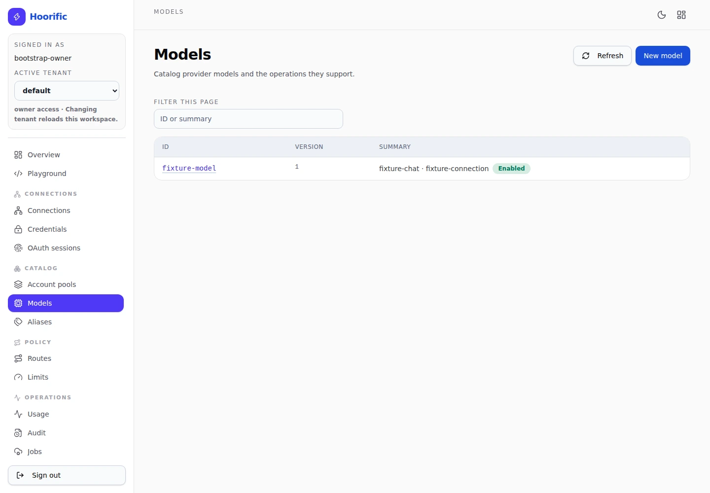
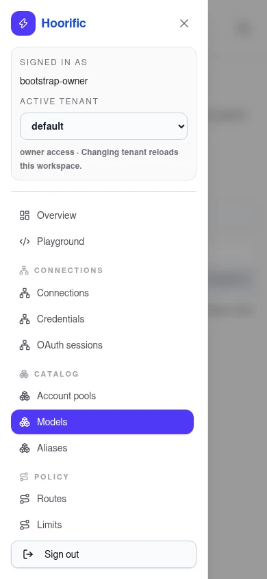

# Hoorific console guide

The Hoorific console is the embedded React operator UI at `/admin/`. It is a workflow-oriented view over the authenticated management API: connect an upstream, review its catalog, define a route, set limits, and optionally send a request from the playground. This guide covers the day-to-day path without repeating installation or API reference material.

> **Screenshots and fixture data.** The screenshots in this guide come from an isolated deterministic fixture session. Names such as `assistant` and `fixture-model`, IDs, counts, and responses are synthetic; they are not provider entitlements or a promise that a fresh deployment already contains these resources. A newly bootstrapped console can be empty and shows only the collections permitted by the signed-in session.

## Contents

- [Before you sign in](#before-you-sign-in)
- [Sign in and bootstrap](#sign-in-and-bootstrap)
- [Tenant scope and roles](#tenant-scope-and-roles)
- [Operations overview](#operations-overview)
- [Collection workflow](#collection-workflow)
- [Recommended setup order](#recommended-setup-order)
- [Connections and credentials](#connections-and-credentials)
- [Models, aliases, routes, and limits](#models-aliases-routes-and-limits)
- [API keys](#api-keys)
- [Playground](#playground)
- [Configuration](#configuration)
- [Mobile, themes, and keyboard](#mobile-themes-and-keyboard)

## Before you sign in

1. Complete the [README native loopback quickstart](../README.md#quickstart-native-loopback), or choose the deployment procedure in [Deployment](deployment.md).
2. Open the management origin with `/admin/` (for example, `http://127.0.0.1:8081/admin/`). The console and management API use the same origin.
3. Decide whether this operator will use the configured OIDC provider or the one-time local bootstrap code. OIDC requires the deployment's identity configuration; it does not appear as a working provider merely because the button is visible.

Do not paste provider secrets, API keys, bootstrap codes, cookies, or token responses into screenshots, issue reports, or public documentation.

## Sign in and bootstrap



*The unauthenticated entry point with an intentionally empty **Bootstrap code** field.*

The login page is titled **Hoorific operations** and offers **Sign in with OIDC**, a **Bootstrap code** field, and a **Redeem code** button. For a native standalone setup, run the README's `admin bootstrap` command, enter the printed one-time code, and submit it once. The bootstrap endpoint deliberately accepts only a loopback peer; a request arriving through a container bridge generally has a non-loopback peer and fails that check. Use the native quickstart for first bootstrap, or configure OIDC and an intentional network/TLS design for a non-loopback deployment. See [Deployment](deployment.md#standalone-compose) for the container boundary.

After sign-in, the sidebar groups the signed-in subject, **Active tenant** selector, and **per-tenant** role in one place. Below the phone breakpoint, the header also keeps the active tenant and role visible while navigation is closed; opening navigation reveals the full context in the drawer. Switching tenants asks for confirmation because unsaved page state will be discarded; cancelling leaves both the selected tenant and the server session unchanged. **Sign out** ends the management session.

## Tenant scope and roles

Hoorific does not currently have a separate global `platform-admin` role. Even `owner` and its wildcard permissions apply through tenant membership. The **Tenants** collection lists memberships, not every tenant in the installation; the remaining collections use the active tenant.

| Role | Console access |
| --- | --- |
| `owner` | Tenant administration, operator identities and role bindings, plus runtime administration. An active owner may create a tenant and becomes its owner. |
| `admin` | Runtime administration, configuration, credentials, keys, routing and limits. Tenant, operator and binding collections are read-only. |
| `operator` | Read catalog/connections, test and discover connections, operate jobs and playground, and inspect usage, admissions, and reconciliations. No catalog or identity administration. |
| `auditor` | Read usage, audit, limits, admissions, and reconciliations. |
| `viewer` | Read catalog collections. |

The server remains authoritative; controls follow effective permissions rather than treating a role name as an implicit global grant. A shared operator identity is globally unique, but its role bindings are per tenant. Creating an operator also creates a `viewer` binding in the active tenant. New binding forms default to `viewer`; choose stronger access deliberately. Existing operator ID/issuer/identity-subject fields and binding subject/tenant coordinates are read-only; mutable display names, enabled state and roles retain their normal version checks. Updating a shared operator requires owner authority in every affected tenant.

Tenant deletion is unsupported and has no console button. The active tenant cannot be disabled from its own session: switch to another enabled tenant where you have the required owner access, then disable or re-enable the target. Last-enabled-owner protection remains enforced. Disabling a tenant invalidates its active sessions; a fresh OIDC login is possible only when the identity resolves to an enabled tenant membership.

### Another tab changed the tenant

Console API and playground requests carry `X-Hoorific-Expected-Tenant` from the page's loaded session. A mismatch with the authenticated tenant returns `409 tenant_context_changed` before resource or inference dispatch. Rejected requests are not automatically retried. Resource and playground drafts remain available until you explicitly reload the context; retain any needed edits before choosing **Reload tenant context**, which replaces the old tenant workspace.

The selector and action panels also offer explicit context reload on this error. API clients may send the same header; it is optional for existing clients, so clients that omit it do not receive this stale-page protection. Admin bearer tokens are independently confined to their issuing tenant and granted scopes, including key rotation; cookie-session tenant switching does not broaden a bearer token.

## Operations overview


*The overview links provider connection, catalog, routing and limits, and an optional request.*

The **Operations overview** offers **Start with a workflow** links to **Connect a provider**, **Add a model or alias**, **Set routing and limits**, and **Run a request** when permitted. Read-only users see review-oriented wording, and roles with narrower access receive an available review destination rather than inaccessible setup instructions.

The sidebar is the collection directory, grouped under **Connections**, **Catalog**, **Policy**, **Operations**, and **Access & identity**. It also includes **Overview**, **Playground**, and, when permitted, **Configuration**. Visible collections are permission filtered: an absent link can mean that the session cannot read that resource, not that the resource type does not exist. The header provides the theme toggle and a shortcut back to the overview.

## Collection workflow

Every resource page starts with its collection. It does not force an editor open until you choose an item or start a new one.

1. Use **Filter this page** with an ID or summary. Filtering is local to the currently loaded page; it is not a server-wide search.
2. Select an ID in the table. The table shows **ID**, **Version**, and **Summary**. If more results exist, use **Next page**, then filter that page separately.
3. Use **Refresh** to request the collection's first page again. A writable page also has **New _resource_**; read-only collections show metadata rather than a write form.



*A list-first collection: filter the loaded page, select an ID, or start a new model.*

### Create, edit, save, and return

A selected writable item opens an editor alongside the list on wide screens and below it at narrower widths. A new editor asks for an **ID**; an existing item's ID is read-only and shows its current **Version**. Edit the labeled fields, then choose **Create** or **Save changes**. A successful save updates the version and returns a `Created.` or `Saved.` notice. Existing resource saves and deletes use an `If-Match` version check, so the console does not silently overwrite a newer server record.

**Return to list** closes the editor. If the draft is dirty, the console asks whether to discard it before selecting another resource, starting a new resource, or returning to the list. Tenant switching also asks for confirmation. Do not assume that every route change or browser reload prompts in the same way. Delete is available for writable existing resources other than tenants and asks for confirmation.

Required fields have a compact asterisk; immutable form fields have a lock cue, and a selected resource's ID is read-only. List errors, such as missing model operations or route targets, block submission and focus a control that can repair the entry. Route weights must be positive; enabled aliases and account pools need members. Price units are stated once for the section, and blank rates still mean unknown rather than free.


*The selected synthetic model's identity and capabilities are visible here; scroll the editor for lower limits and save controls.*

### Version conflicts

If another writer changes an item after you opened it, saving can show **Version conflict**. The console retains **Your retained draft** and displays the newer **Server version**. The stale draft cannot be saved with its old `If-Match` version. To keep desired edits, note or copy them, choose **Reload server version**, reapply those edits to the fresh server copy, and then choose **Save changes**; the console does not merge the two versions for you.

A stale delete is also rejected and leaves the editor available. For deeper storage, concurrency, and recovery behavior, see [Deployment](deployment.md).

## Recommended setup order

Use this as a recommended order for a new tenant; adapt it when a connector supplies optional metadata or catalog data is already known.

1. **Connections** — register the provider connector, optional account ID/base URL, and optional region/project/settings, then save it.
2. **Credentials** — authorize the connection through its credential lifecycle before using **Test** or **Discover models**; do not treat the metadata collection as a secret store.
3. **Models** — review discovery results and create the catalog entries you intend to expose. Check each model's connection, upstream ID, operations, modalities, features, limits, enabled state, and any price schedule you have verified.
4. **Aliases** — create a stable alias and associate one or more catalog model IDs. Routes target the alias rather than requiring clients to know provider IDs.
5. **Routes** — map the alias to connection/model targets, priorities, weights, residency, fallback, account-pool, and affinity choices.
6. **Limits** — add tenant, key, connection, account, or model policy limits for requests, tokens, cost, concurrency, and outstanding jobs.
7. **API keys** — issue the smallest key scope that can exercise the intended alias, connection, and exact operation.

## Connections and credentials

Select a connection and choose **View actions** to scroll to and focus its action controls. Depending on permissions, the actions include **Test**, **Discover models**, and **Disable**; **Delete** is in the resource editor. A connection form uses **Connector**, **Account ID**, **Base URL**, **Region**, **Project**, **Dedicated**, **Enabled**, and **Connection settings (JSON object of string values)**. **Disable** refreshes the selected resource version; **Test** and **Discover models** return their action results without replacing the open editor. A clean editor follows a refreshed server state; an unsaved draft is retained with an explicit refresh notice and remains protected by version checks.

Credentials are deliberately metadata-first. The collection can show status, version, and owning connection metadata, but not the secret value. The selected connection's **Credential lifecycle** panel can refresh encrypted-store metadata and show **Current credential version**. Expand only the flow you need; collapsing a flow does not discard its fields:

- **API-key credentials** lets an API-key connection **Import API key**; replacing or rotating a secret is version checked. The secret is write-only and is cleared after the attempt.
- **OAuth authorization** starts the provider flow for connectors that support it and can continue with the returned authorization URL, state, callback code, and redirect URI.
- **Device authorization** starts a device flow for connectors that support it, shows its provider code and verification URL, and lets you poll with the flow ID.
- **Revoke credential** is version checked and prevents new requests from leasing that credential until a replacement is authorized.

The guide intentionally has no credential screenshot. Keep secrets in the operator's protected workflow; see [Deployment master-key handling](deployment.md#master-key-handling) for the encrypted-store recovery boundary.

## Models, aliases, routes, and limits

**Models** use **Connection ID**, **Upstream model ID**, operation and modality lists, and a **Features** JSON object whose string values are `supported`, `unsupported`, or `unknown`. Context/output limits, provenance, and **Enabled** are also available. A price schedule is optional; blank rates mean unknown, not free.

**Aliases** use the resource ID as the stable route name, a description, an enabled switch, and a list of **Model IDs**. In **Routes**, set **Model alias** plus route options, then add at least one target with **Connection ID**, **Model ID**, priority, weight, and optional region. **Explain dry-run** on a saved route shows the route analysis available to your role; it does not replace an actual request.

**Limits** select a **Policy scope** (`tenant`, `key`, `connection`, `account`, or `model`) and **Scope ID**, then set requests/minute, tokens/minute, maximum cost, cost window (`total`, `daily`, or `monthly`), concurrent requests, and outstanding jobs. For quantity fields, zero or a blank optional value means no configured limit; a blank cost window uses `total`. Treat price and cache settings as operator-controlled accounting data; read [Cost, caching, and replay safety](deployment.md#cost-caching-and-replay-safety) before changing production policy.

## API keys

The **API keys** collection exposes metadata rather than the secret. Expand **Issue an API key** when a new external inference client needs access. **Key ID**, **Name**, **Permissions**, and **Operations** are required by the issuance form. Choose a **Role** (`viewer`, `operator`, or `admin`), then use aliases, connections, and exact operation names to configure the grant; the panel also shows the tenant and optional **Portable**, **Native account**, and **Realtime** flags. The token is returned once and is not stored in resource metadata, so copy it into the protected client configuration immediately.

A selected key's **Key actions** can **Rotate** or **Revoke** it. Both are explicit actions; revocation cannot be undone and blocks the revoked key from new admission. Keep a separate record of which alias, connection, operation, and policy limit a key is intended to use.

## Playground


*The captured terminal portion of a completed fixture-only SSE stream: visible O/K chunks, total usage 11, and terminal `[DONE]` are synthetic and do not demonstrate provider access.*

The **Inference playground** is available to a signed-in session with the `playground:execute` permission. It sends JSON through the authenticated gateway and shows streamed events without leaving the page. For the deterministic local fixture only, choose **Chat generation** and use this body:

```json
{
  "model": "assistant",
  "messages": [{"role": "user", "content": "Reply exactly OK"}],
  "stream": true,
  "stream_options": {"include_usage": true}
}
```

`assistant` is the fixture alias used by the deterministic qualification path; it may not exist in your tenant. The playground uses the signed-in management session and does not require an external API key. For a non-fixture request, first configure a real alias, route, and connection credential; issue an API key only when an external inference client will call the inference listener.

**Chat generation**, **Responses**, **Image generation**, and **Audio speech** each have a starter body and editable **Gateway operation path**. Switching operations preserves their separate drafts and paths. Responses starts with `store: false`; image generation requests base64 image output, and speech requests playable WAV audio. The playground has no portable video operation or `/v1/videos` preset. JSON is parsed in the browser and is not saved across page reloads. Optional files are available for Chat and Responses only: on Chat, an image becomes nested image content and another file becomes a nested file part with `file_data` and `filename` on the last user message; on Responses, they become nested `input_image` or `input_file` content on the last user input. A selected file stays in the tab when switching operations; Image generation and Audio speech show that it will not be sent and provide **Remove**.

Choose **Send request** to begin. Invalid JSON is rejected before dispatch. **Copy response text** copies the textual response; clipboard failures are reported. For media responses, image and binary-audio previews with download links appear before a collapsed **Response details** section; binary audio keeps its response MIME type and is not decoded as text. **Clear output** removes text and media when no request is running and releases browser object URLs. **Cancel** aborts the browser stream, retains partial output, and marks it **Cancelled**. Cancellation is not a refund, does not prove that upstream work stopped, and is not evidence that no provider cost was incurred; review usage/admissions and the [qualification evidence guidance](qualification.md#evidence-interpretation) before interpreting a run.

For portable OpenAI Chat streaming, keep `stream_options.include_usage: true` when you want the terminal usage event visible in the client stream. Omitting it hides usage from the client but does not disable internal accounting. Protocol limits, cache controls, and replay behavior belong in [Deployment](deployment.md#cost-caching-and-replay-safety), not in this UI walkthrough.

## Configuration

**Export snapshot** displays a redacted, read-only runtime snapshot and fills the current configuration revision. It does not replace the draft: exported display fields and redacted references are not an apply-ready configuration. The form lists supported resource maps; `{"connections":{}}` is a safe no-op example. Enter a draft and positive revision before **Preview changes** or **Apply** becomes available. Successful application reports its result and requires another edit before applying again.

Owner token issuance and revocation are under **Manage scoped admin tokens**. These are tenant-confined management tokens, not inference API keys; issued secrets are shown once. Keep the disclosure closed when you do not need it.

## Mobile, themes, and keyboard



*At mobile width, the navigation drawer opens over the Models collection; the image is kept at a readable 320-pixel width.*

At narrow widths the sidebar becomes a drawer. Use **Open navigation**, choose a link, or use **Close navigation**. Selecting a route closes the drawer. Press **Escape** to close it and return focus to the menu button; while open, **Tab** and **Shift+Tab** stay within the drawer. On wider screens the sidebar remains visible and resource forms adapt to their available column width.

Use the moon/sun control in the header to switch light and dark themes. The choice is stored locally; absent a stored choice, the console follows the browser's preferred color scheme. Normal links, buttons, native selects, text inputs, textareas, and checkboxes are keyboard reachable. The visible focus ring identifies the active control, and Enter submits the current form where that form has a submit action.

For deployment, encryption, pricing, caching, replay, and storage boundaries, see [Deployment](deployment.md). For deterministic browser, standalone, cluster, and optional live-provider procedures, see [Qualification](qualification.md).
